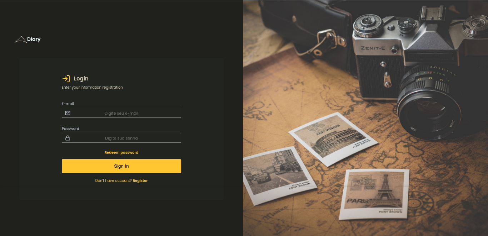

<h1 align="center"> Traveling </h1>

    Website para compra de viagens.

  <a href="#tecnologies">Tecnologias</a>&nbsp;&nbsp;&nbsp;|&nbsp;&nbsp;&nbsp;
  <a href="#project">Projeto</a>&nbsp;&nbsp;&nbsp;|&nbsp;&nbsp;&nbsp;
    <a href="#orientações">Orientações</a>&nbsp;&nbsp;&nbsp;|&nbsp;&nbsp;&nbsp;
  <a href="#desafios">Desafios</a>&nbsp;&nbsp;&nbsp;|&nbsp;&nbsp;&nbsp;
  <a href="#extres">Extras</a>&nbsp;&nbsp;&nbsp;|&nbsp;&nbsp;&nbsp;
  <a href="#memo-licença">Licença</a>

  

 

  

## 🚀 Tecnologias

 Esse projeto foi desenvolvido com as seguintes tecnologias: 

- HTML e CSS Puro;
- PHP;
- Composer.

## 💻 Projeto

 O "Traveling" é um projeto desenvolvido com base no MVC, o objetivo era pôr em prática tudo aquilo que aprendi sobre a arquitetura. Outro objetivo meu, era simplesmente praticar mais CSS, por isso o tema, o layout não foi criado por mim mesmo, ele é de um desafio da Rockeseat, logo veio a mente um site de viagens. Apliquei algumas técnicas, entre elas estão: 

  <ul style="margin-left: 20px;">
      <li> Mobile First; </li>
      <li> Flash messages. </li>
  </ul>

## 🗺️ Orientações

 Apenas necessário ter o composer instalado.

<ul style="margin-left: 20px" id="orientations">
  <li> Instale as depedências; </li> 
  <li> Rode em seu terminal o comando 'php -S localhost:port -t public'; </li>
  <li> Devido a falta de criatividade para as interfaces para as páginas, a página 'home' está quase em branco, logo assim que entrar, vá ate a url e digite '/login' para ser redirecionado a parte que realmente importa. </li>
</ul>

## ⚔️ Desafios enfrentados

 O principal desafio de longe foi trabalhar com CSS, tive muitas dificuldades para fazer a tela de login, pôr a imagem de um jeito adequado foi difícil, mas consegui. Quanto ao MVC, não tive tantas dificuldades, já que fui assisitindo as aulas e pondo em prática ao mesmo tempo. 

## 🧑‍🔧 Extras

 
  Há muitas melhorias a se fazer, algumas logo abaixo:

  <ul style="margin-left: 20px">
      <li> Criação de outras telas para fazer sentido ao site; </li>
      <li> Aplicar SASS; </li>
      <li> Aplicar resgate de senha; </li>
      <li> Implementar 'hidden/show' no campo senha. </li>
  </ul>

<ul style="margin-left: 20px" id="orientations">
    
</ul>

## :memo: Licença

Esse projeto está sob a licença MIT.